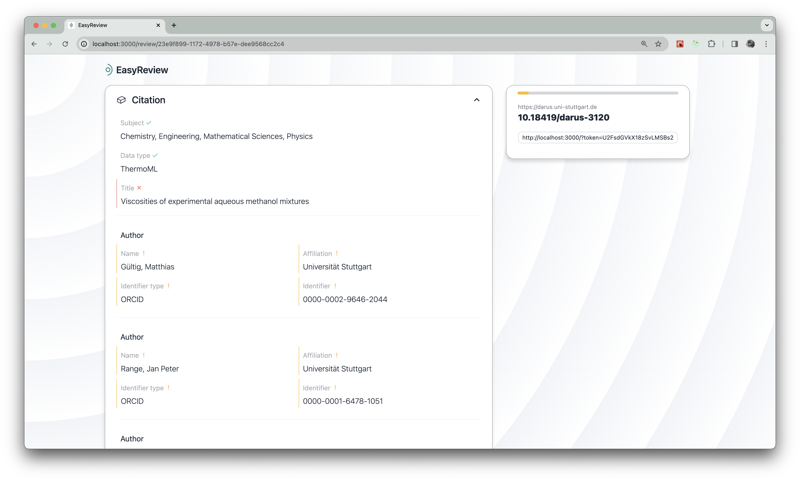

# EasyReview

> [!IMPORTANT]
> EasyReview is currently under development and changes to the API and the database schema are likely to happen.

<p align="center">
    
</p>

## Build and run the project

In order to use EasyReview, you first need to create a `.env` file in the root directory of the project. The file should contain the following variables:

```bash
# PostgreSQL
POSTGRES_HOST=postgres
POSTGRES_DB=app_db
POSTGRES_USER=app_db_user
POSTGRES_PASSWORD=supersecretpassword
POSTGRES_PORT=5432

# Redis
REDIS_HOST=redis
REDIS_PORT=6379
REDIS_PASSWORD=supersecretpassword
BROKER_URL=redis://:supersecretpassword@redis:6379/0
REDIS_CHANNEL_URL=redis://:supersecretpassword@redis:6379/1
CELERY_URL=redis://:supersecretpassword@redis:6379/0

# Django
NEXT_PUBLIC_DJANGO_HOST=localhost # Required for client side API calls
NEXT_PUBLIC_DJANGO_PORT=8000 # Required for client side API calls
NEXT_PUBLIC_DJANGO_SUPERUSER_PASSWORD=supersecretpassword
NEXT_PUBLIC_DJANGO_SUPERUSER_USERNAME=admin
NEXT_PUBLIC_DJANGO_SUPERUSER_EMAIL=admin@admin.com
```

Then, you can build and run the project using the following command:

```bash
docker compose up -d
```

Once setup, you can access the EasyReview web interface at `http://localhost:3000` and the API at `http://localhost:8000/`. The REST API documentation is available at `http://localhost:8000/api/`.

## Adding datasets for review

Datasets can be added either via the external tools URL schema or via EasyReview's REST-API. The following sections describe both options.

### Via external tools URL schema

The following URL schema can be used to add datasets to EasyReview:

```bash
http://myhost:3000/?siteUrl=<str:siteUrl>&apiToken=<str:apiToken>&datasetPid=<str:datasetPid>
```

Parameters:

- `siteUrl`: The URL of the Dataverse instance where the dataset is hosted.
- `apiToken`: The API token of the Dataverse instance where the dataset is hosted.
- `datasetPid`: The DOI of the dataset.
